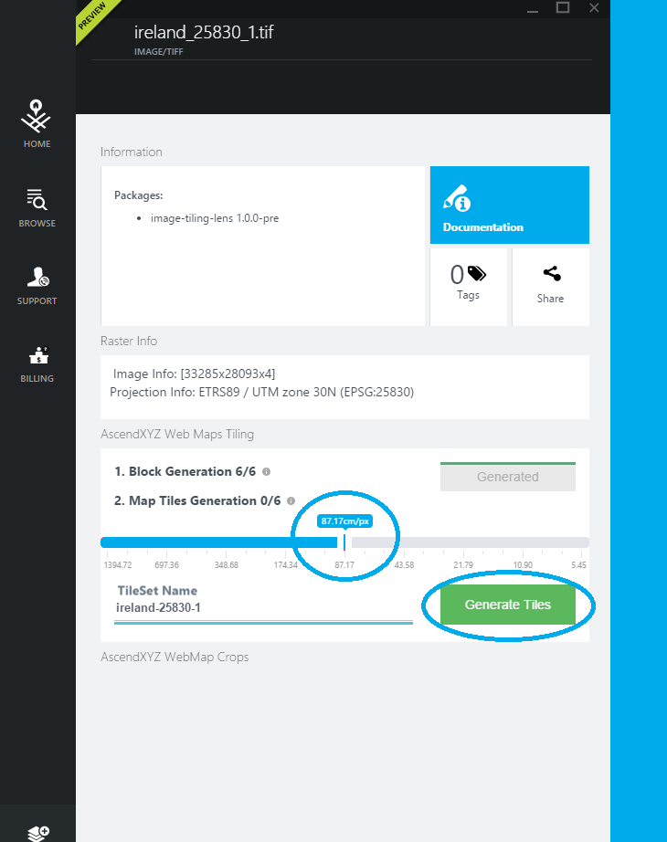

#AscendXYZ GeoTIFF Tiling and Sharing of Webmaps

If you are not a user of the AscendXYZ portal, go to **portal.ascend.xyz** and register, it is free:-) For instructions: [Create User and Subscription](./Create User and Susbscription.md)

##Create tiles
If you are already on the portal, follow these instructions to tile and publish your webmap.
* Sign in create a workset and upload the GeoTIFF you want to tile.
* When the upload has finished click the file.
* Click 'Generate Blocks' and wait for the process to finish. The time depends on the size of your GeoTIFF.

* Select maximum GSD with the slider.
* Click 'Generate Tiles' and wait for the process to finish. The time depends on the size of your GeoTIFF.

##Create and Share your Webmap
* Click the share button.
* Name your map and click 'Create Link'.
* Share your map as a link or via social media.

