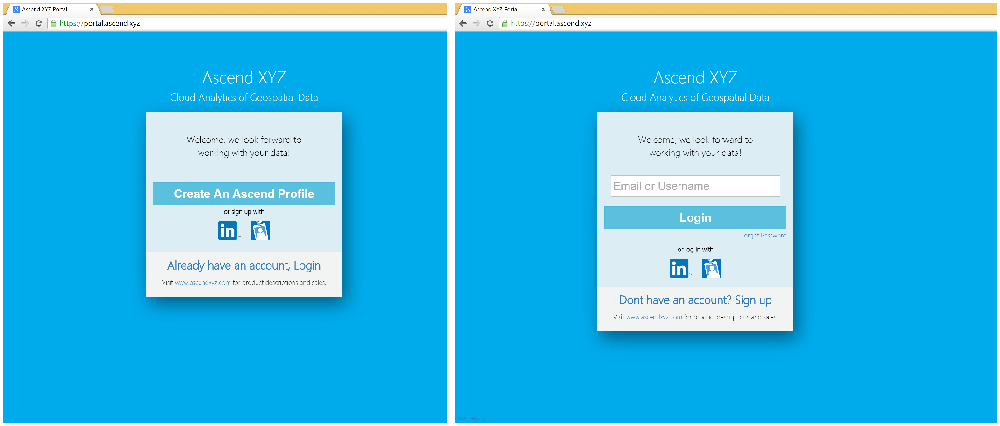
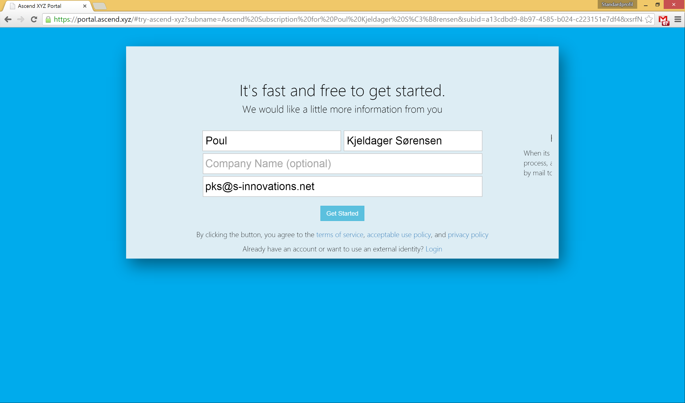
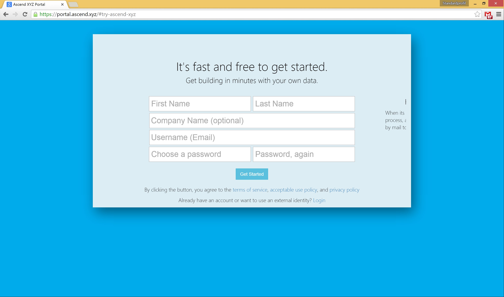
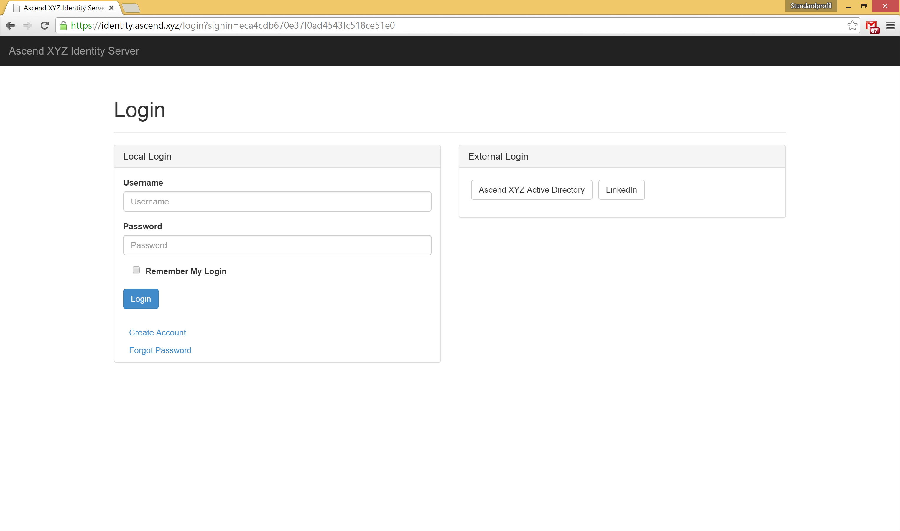
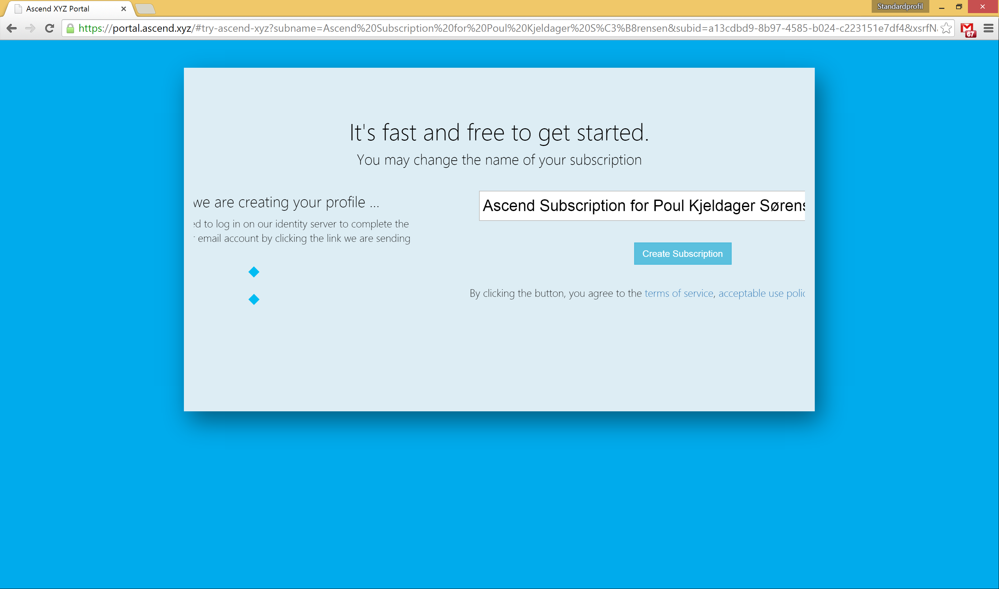
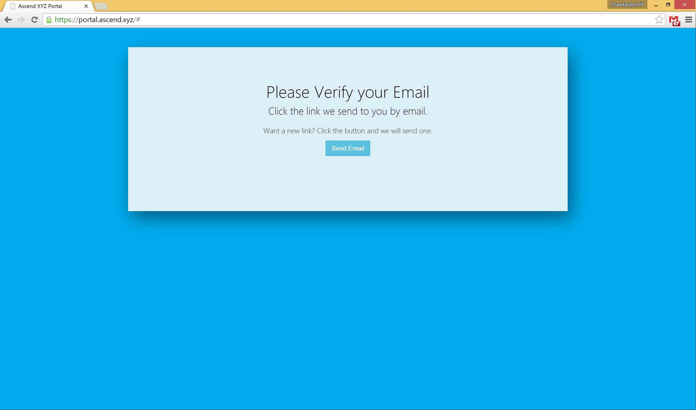
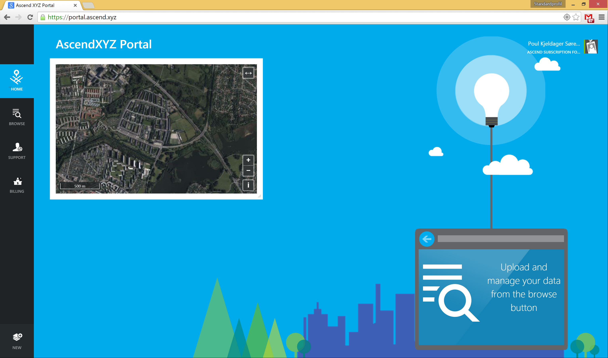

#Creating an Ascend User and Subscription

If you prefer watching videos, we made this video for you going over the steps of creating an user, alternative you can continue reading below.

https://vimeo.com/122953681

and when successful logged in, you may also want to read:

* [Understanding the AscendXYZ File System ](./Understanding the AscendXYZ File System.md)
* [AscendXYZ Portal Interface Overview ](./AscendXYZ Portal Interface Overview.md)
* [Ground Control Points(GCPs) and Georeferencing ](./Ground Control Points(GCPs) and Georeferencing.md)
* [VIDEO: Package Manager and Map Production Price ](https://vimeo.com/123604920)
* [VIDEO: Map Production Request ](https://vimeo.com/123826702)

We support either signup with linkedIn (external accounts) or creating your own username and password (we will refer to this as a local account). Visiting https://portal.ascend.xyz you will be presented with either of the two above screens, depending on if you have successful signed in before. 

## LinkedIn
For using your LinkedIn account please navigate to https://portal.ascend.xyz and click the linkedIn Icon, this will take you to linkedIn where you are asked to give consent and when coming back to the sign up formula, we have pre-filled it with the information we could get from linkedIn as seen in the image here:

## Local Accounts

You can navigate directly to https://portal.ascend.xyz/#try-ascend-xyz for creating a local account and the process is similar to the above steps for social accounts. The only difference is that you need to provide all the information your self.

In step two of local accounts we need you to login at the identity server also with your just created username and password.

We will in future releases work on integrating the identity server to the general UX design of the portal, but for now bear with us. 

##Subscriptions

continuing the flow, it will slide right to the create subscription formula. If you intend to get your identity added to an existing subscription from your company, then you may continue to the verify email section and close browser at this stage. We will be adding in one of the upcoming released such subscriptions owners can add you to their existing subscription.

After having access to a subscription you can continue to the verify email section.

##Verify Email

Before being able to complete the login to your dashboard you must have verified you email account by clicking a link that we send to the email account you entered when signing up. We encourage you to put ascend.xyz and ascendxyz.com domains on your safe senders lists to not miss any important mails from us.

Until your email has been verified, you will meet the following verification screen that also allows you to resend your verification link.

## Dashboard
When successful authenticated to the portal you should see this dashboard.

To learn more we have the following links you may read:

* [Understanding the AscendXYZ File System ](./Understanding the AscendXYZ File System.md)
* [AscendXYZ Portal Interface Overview ](./AscendXYZ Portal Interface Overview.md)
* [Ground Control Points(GCPs) and Georeferencing ](./Ground Control Points(GCPs) and Georeferencing.md)
* [VIDEO: Package Manager and Map Production Price ](https://vimeo.com/123604920)
* [VIDEO: Map Production Request ](https://vimeo.com/123826702)

