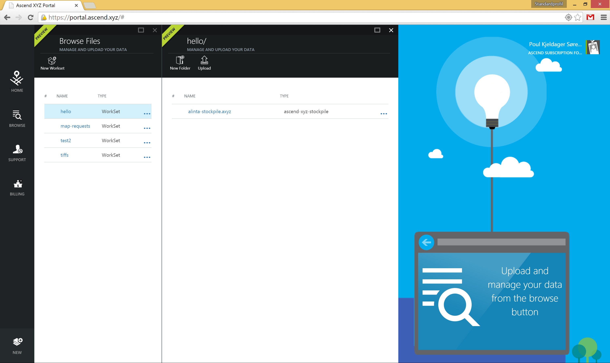

#Understanding the AscendXYZ File System

#Introduction

The AscendXYZ File system is composed of worksets and files. Worksets are containers that you as a user can put any file into, that you would like stored in the AscendXYZ Platform. By using the AscendXYZ Portal, we will at AscendXYZ create views and data manipulations for you to gain the most of your geospatial data. All of the AscendXYZ Analytics also runs on top of this file system, such users and partners can generate new data based on the data they provide. 

One example of this is how our Map Production Pipeline works currently where users uploads their images and auxility data into a workset and by filling out a Map Production Request the pipeline is started, resulting in a generated AscendXYZ WebMap is produced and returned to the user. The users may then decide for them self where they would like to store the AscendXYZ WebMap within their subscription.

This is also the pattern we will be following for future products, where some input data is needed and using the Portal, users will be able to get the most out of their data.

#Worksets
Worksets are a container of files that we at AscendXYZ can distribute and load balance across the platform, ensuring high performance and scale for all our users and partners. In this document we will try to provide guidelines for when to create new worksets by giving examples based on our prior experience with users.

The general advice for worksets are to create them for when creating new projects or groups of data. A group of data is in many cases one aqusition of data from a plane or car. To get the best performance its recommended that worksets contains less than 2500 images, but this is not a limit, so if you create large map productions you should still keep all the files in one workset.

## Workset Examples
* Map Productions, We recomand that for that a new workset is created for each Map Production. 

#Files and Folders
Within each workset users can upload files and create sub folders in any way they see fits. We will also in this document try to provide guidelines for trivial tasks as we learn these based on the user patterns we see. 

#Current Limitations
There is a current limitation in Files and Folders where Folders are only virtual created when they have content in them. This means that if a folder is created and nothing gets uploaded to it, then it wont show up. So if you experience that the folders disappear again after creating them, it is because no data was added to them. This is something we will address in a future release.

